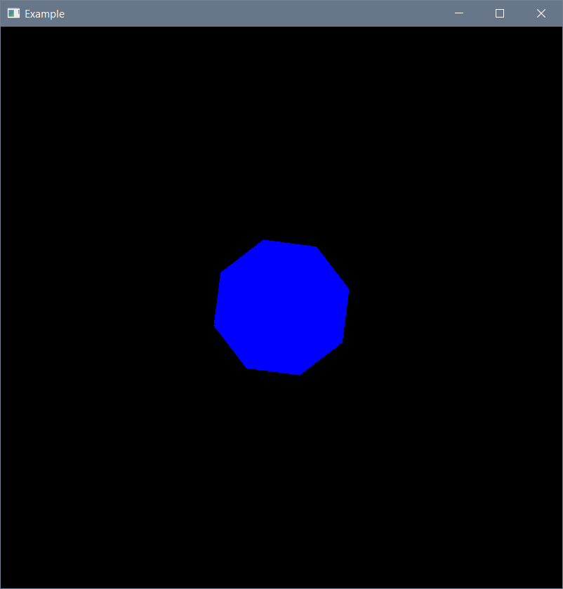

# Primitives
## A 2D grapichs library, based on SFML and Vector2D

Библиотека представляет собой интерфейс для работы с SFML, предназначенный для более удобной работы с простыми объектами: круг,
прямоугольник, треугольник и правильные многоугольники. Основана на 
[замечательной билиотеке авторства skomaroh1845](https://github.com/skomaroh1845/Linal).

Все классы фигур являются наследниками класса `Object` – общей сущности рисуемого объекта. Для общего взаимодействия с фигурами есть
методы, позволяющие их передвигать (`setLoc(float x, float y)` или `move(Vector2D &v)`), вращать (`rotate(float angle)`), перекрашивать
(`fill(int r, int g, int b)`) или менять геометрические параметры. Для удобства у каждой функции есть комментарий, описывающий её
использование.

Для работы с примитивами необходима библиотека SFML, хотя используется там только объект `RenderWindow` (он не был заменен с целью
сохранения функционала взаимодействия с пользователем, такого как нажатие клавиш).

Пример когда снизу рисует в центре правильный многоугольник синего цвета, повёрнутый на 30 градусов по часовой стрелке.

```c++
#include "rPolygon.h"
#include <SFML/graphics.hpp>

int main() {
    Object *o = new rPolygon(400, 400, 100, 8);

    o->rotate(30);
    o->fill(0, 0, 255);

    sf::RenderWindow window(sf::VideoMode(800, 800), "Example");
    while (window.isOpen()) {
        sf::Event event;
        while (window.pollEvent(event)) {
            if (event.type == sf::Event::Closed)
                window.close();
        }
        window.clear();
        o->display(window);
        window.display();
    }
    return 0;
}
```

